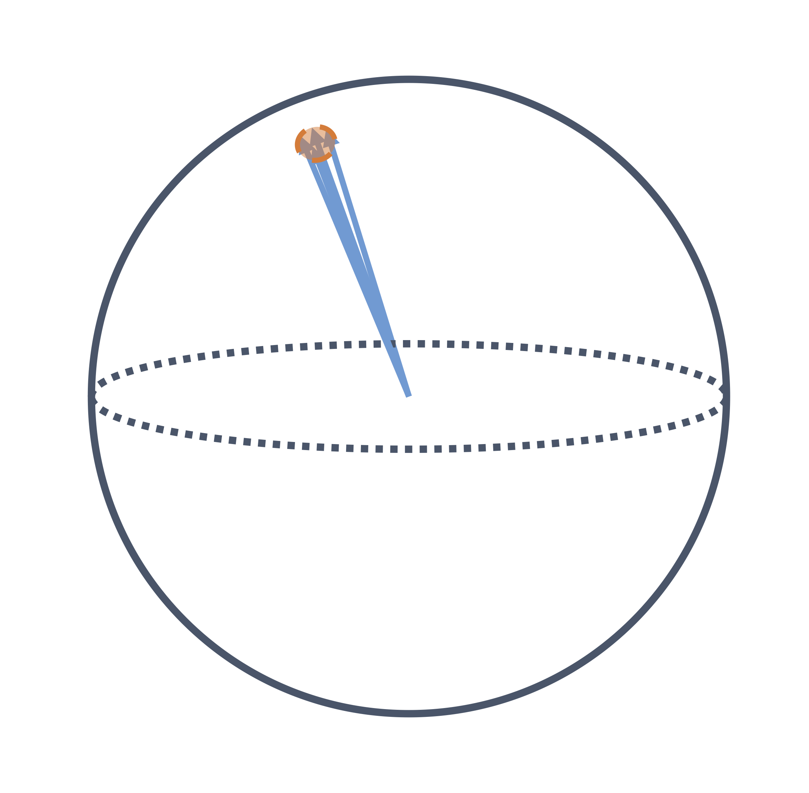
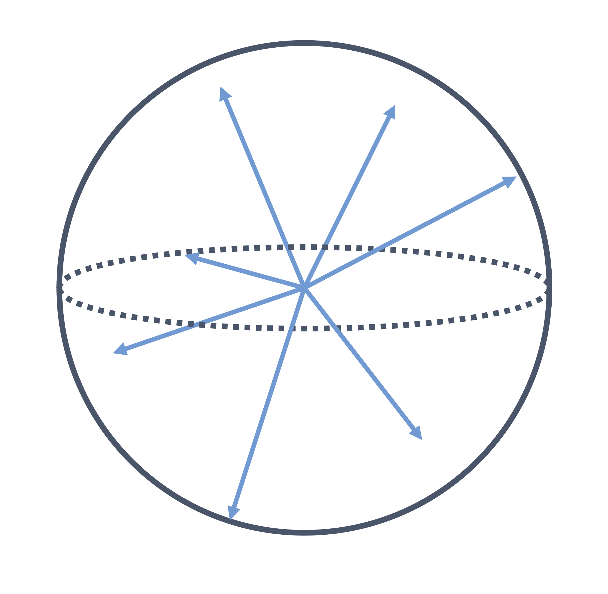
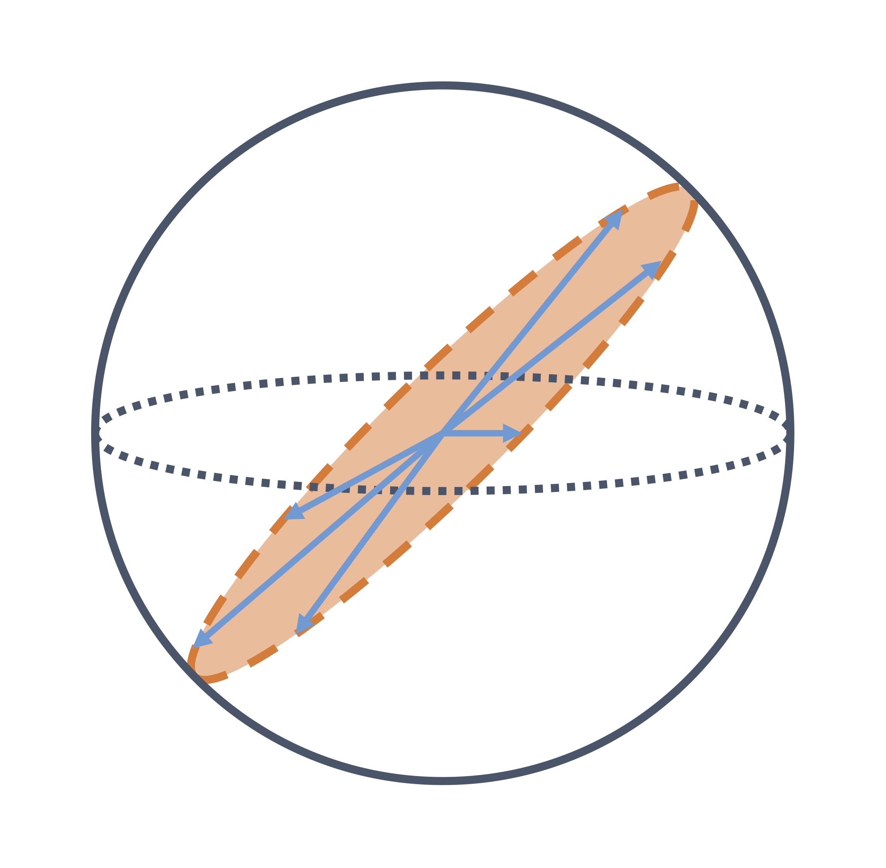
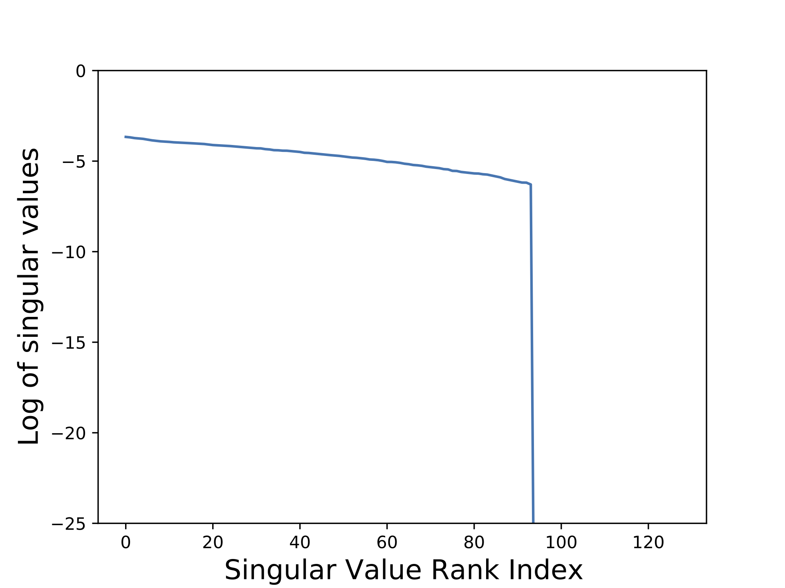

# Understanding Dimensional Collapse in Contrastive Self-supervised Learning

This repo contains the code used in paper [Understanding Dimensional Collapse in Contrastive Self-supervised Learning](https://arxiv.org/abs/2110.09348).
<p align="center">
  
  
  
</p>

```
@article{Jing2021UnderstandingDC,
  title={Understanding Dimensional Collapse in Contrastive Self-supervised Learning},
  author={Li Jing and Pascal Vincent and Yann LeCun and Yuandong Tian},
  journal={arXiv preprint arXiv:2110.09348},
  year={2021}
}
```

## Part 1: Visualize SimCLR's embedding Spectrum

We viaulize the embedding space spectrum of a pretrained SimCLR model. 
<p align="center">
  
</p>

The spectrum is generated by [spectrum.py](spectrum.py).

How to use:
```
python spectrum.py --data <path-to-imagenet-data> --checkpoint <path-to-checkpoint> --projector
```


## Part 2: Toy Tasks

We show that 2 reasons (strong augmentaiton and implicit regularization) cause dimensional collapse in contrastive learning via toy tasks. 
Please see [toy_tasks](https://github.com/facebookresearch/directclr/tree/main/toy_task).

## Part 3: DirectCLR

DirectCLR is a simple contrastive learning model for visual representation learning. It does not require a trainable projector as SimCLR. It is able to prevent dimensional collapse and outperform SimCLR with a linear projector.

<p align="center">
  
</p>

For training / evaluation detail, please see [diretclr](https://github.com/facebookresearch/directclr/tree/main/directclr).


### License

This project is under the CC-BY-NC 4.0 license. See [LICENSE](LICENSE) for details.
