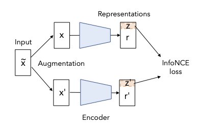

# DirectCLR

DirectCLR is a simple contrastive learning model for visual representation learning. It does not require a trainable projector as SimCLR. It is able to prevent dimensional collapse and outperform SimCLR with a linear projector.

<p align="center">
  
</p>

PyTorch implementation of DirectCLR from paper [Understanding Dimensional Collapse in Contrastive Self-supervised Learning](https://arxiv.org/abs/2110.09348).

```
@article{Jing2021UnderstandingDC,
  title={Understanding Dimensional Collapse in Contrastive Self-supervised Learning},
  author={Li Jing and Pascal Vincent and Yann LeCun and Yuandong Tian},
  journal={arXiv preprint arXiv:2110.09348},
  year={2021}
}
```

### DirectCLR Training

Install PyTorch and download ImageNet by following the instructions in the [requirements](https://github.com/pytorch/examples/tree/master/imagenet#requirements) section of the PyTorch ImageNet training example. The code has been developed for PyTorch version 1.7.1 and torchvision version 0.8.2, but it should work with other versions just as well. 

Our best model is obtained by running the following command:

```
python main.py --data /path/to/imagenet/ --mode directclr --dim 360
```
`Mode` can be chosen as:

`simclr`: standard SimCLR with two layer nonlinear projector;

`single`: SimCLR with single layer linear projector;

`baseline`: SimCLR without a projector;

`directclr`: DirectCLR with single layer linear projector;


Training time is approximately 7 hours on 32 v100 GPUs.

### Evaluation: Linear Classification

Train a linear probe on the representations. Freeze the weights of the resnet and use the entire ImageNet training set.

```
python linear_probe.py /path/to/imagenet/ /path/to/checkpoint/resnet50.pth
```

Linear probe time is approximately 20 hours on 8 v100 GPUs.

### License

This project is under the CC-BY-NC 4.0 license. See [LICENSE](LICENSE) for details.